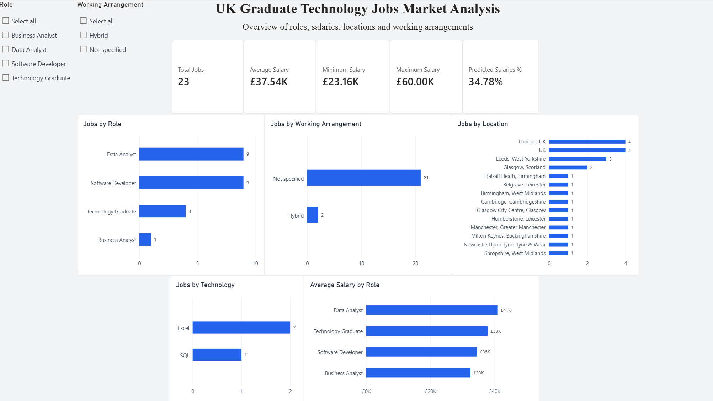

# UK Graduate Technology Jobs Market Analysis

In this project, I investigated recent UK graduate technology vacancies advertised through Adzuna.

The project aimed to explore how job roles, salaries, locations, working arrangements and technology requirements varied across the collected vacancies.

To do this, I collected data using the Adzuna API, processed the data using Python, stored the cleaned data in PostgreSQL, analysed it using SQL and then visualised the results in Power BI.

## Dashboard



## Tech Stack

- **Python** - API data collection and data processing
- **Pandas** - Data cleaning, transformation and validation
- **PostgreSQL** - Relational database for storing the processed job data
- **SQL** - Data analysis and querying
- **Power BI** - Interactive dashboard, data modelling and visualisation
- **Git & GitHub** - Version control and project documentation

## Data Pipeline

**Adzuna API -> Python -> Data Cleaning & Validation -> PostgreSQL -> SQL Analysis -> Power BI**

Raw job vacancy data was collected from the Adzuna API and stored as JSON. The data was then cleaned, filtered, transformed and validated using Python and Pandas before being loaded into PostgreSQL. SQL was used to query and analyse the processed data, with the results connected to Power BI to create an interactive dashboard exploring the collected vacancies.

## Data Collection

Job vacancy data was collected using the Adzuna API. I searched for a range of technology roles including Data Analyst, Data Engineer, Software Engineer, Software Developer, Business Analyst, BI Analyst, Data Scientist and Technology Graduate roles.

The API was queried for vacancies posted within the previous 30 days, collecting up to three pages of results for each search term with 50 results per page. This produced an initial raw dataset of 1,060 job listings, which was stored as JSON before cleaning and filtering.

## Data Cleaning and Transformation

The raw API data required cleaning and filtering before it could be used for analysis. The main cleaning steps included:

- Flattening nested API fields such as company, location and category.
- Removing duplicate vacancies using Adzuna job IDs.
- Identifying graduate and entry level vacancies using relevant keywords.
- Filtering the data to retain relevant technology roles.
- Removing internships, apprenticeships, training programmes and other vacancies outside the scope of the analysis.
- Standardising vacancies into role categories to allow comparisons between similar jobs.
- Calculating salary midpoints from the available minimum and maximum salary values.
- Identifying whether salary values were predicted by Adzuna.
- Classifying working arrangements only where hybrid or remote working was explicitly mentioned.
- Extracting explicitly mentioned technologies from the available job descriptions.
- Validating the remaining records and manually removing confirmed duplicate listings.

After cleaning and filtering, the final analytical dataset contained **23 graduate technology vacancies** across four role categories.

## Database Design and SQL Analysis

The cleaned data was loaded into PostgreSQL and organised into a relational database consisting of three main tables:

- **jobs** - Stores the main information for each vacancy, including role, company, location, salary and working arrangement.
- **technologies** - Stores each unique technology identified in the job descriptions.
- **job_technologies** - A bridge table linking jobs to technologies, allowing a job to be associated with multiple technologies.

This structure was used to model the many-to-many relationship between jobs and technologies while avoiding repeated technology data.

SQL queries were then used to analyse the dataset, including:

- The number of vacancies by role category.
- Average, minimum and maximum salaries.
- Average salary by role.
- The distribution of working arrangements.
- The number of vacancies by location.
- The frequency of explicitly mentioned technologies.
- The proportion of salaries predicted by Adzuna.

## Power BI Dashboard

The PostgreSQL database was connected directly to Power BI to create an interactive dashboard for exploring the final dataset.

The dashboard includes:

- KPI cards showing total vacancies, average salary, minimum salary, maximum salary and the percentage of salaries predicted by Adzuna.
- Comparisons of vacancy counts and average salaries across role categories.
- Analysis of vacancies by location and working arrangement.
- Technology frequency based on explicit mentions in the available job descriptions.
- Interactive filters for role category and working arrangement, allowing the dashboard metrics and visualisations to update dynamically.

## Key Findings

Analysis of the final 23 vacancies identified several patterns within the collected sample:

- **Data Analyst** and **Software Developer** were the most common role categories, with 9 vacancies each. Technology Graduate roles accounted for 4 vacancies, while 1 Business Analyst vacancy was included.
- The average salary across the collected vacancies was approximately **£37,540**, with salaries ranging from approximately **£23,160 to £60,000**.
- Most vacancies did not explicitly state a working arrangement in the available data. **21 of 23** were classified as "Not specified", while **2** explicitly mentioned hybrid working.
- **Excel** was explicitly identified in 2 vacancies and **SQL** in 1. Technology results should be interpreted cautiously because the descriptions provided by the API may be truncated.
- **34.78%** of the salary values in the final dataset were predicted by Adzuna rather than explicitly provided by the employer.

## Limitations

The analysis has several limitations that should be considered when interpreting the results:

- The final dataset contains 23 vacancies collected through Adzuna and therefore should not be considered representative of the entire UK graduate technology job market.
- Adzuna provides shortened job descriptions for some vacancies, which limits the ability to identify all technologies, skills and working arrangements mentioned in the original job adverts.
- Some salary values are estimates produced by Adzuna rather than salaries explicitly provided by employers.
- Location data varies in its level of detail, with some vacancies providing specific cities or regions while others only specify a broader location such as "UK".
- The number of vacancies differs substantially between role categories. For example, only one Business Analyst vacancy remained in the final dataset, meaning comparisons involving this category should be interpreted cautiously.
- The data represents vacancies collected during a specific 30-day period and may not reflect longer-term trends or seasonal changes in graduate recruitment.

## Repository Structure

```text
Graduate-Job-Analysis/
  dashboards/
    dashboard_preview.png
    graduate_jobs_dashboard.pbix
  data/
    processed/
      jobs_clean.csv
    raw/
      tech_jobs.json
    data_dictionary.md
  sql/
    analysis.sql
    load_data.sql
    schema.sql
  src/
    clean_data.py
    fetch_jobs.py
  .gitignore
  LICENSE
  README.md
  requirements.txt
```

## How to Run the Project

### 1. Clone the repository

```bash
git clone https://github.com/RobbieHowells/Graduate-Job-Analysis.git
cd Graduate-Job-Analysis
```

### 2. Create and activate a virtual environment

```bash
python -m venv .venv
```

On Windows:

```bash
.\.venv\Scripts\activate
```

### 3. Install the required packages

```bash
pip install -r requirements.txt
```

### 4. Configure the Adzuna API

Create a `.env` file in the root of the project and add your own Adzuna API credentials:

```text
ADZUNA_APP_ID=your_app_id
ADZUNA_APP_KEY=your_app_key
```

### 5. Collect and process the data

Run the data collection script:

```bash
python src/fetch_jobs.py
```

Then clean and process the collected data:

```bash
python src/clean_data.py
```

### 6. Set up the PostgreSQL database

Create a PostgreSQL database for the project, then run the SQL scripts in the following order:

```text
sql/schema.sql
sql/load_data.sql
sql/analysis.sql
```

- `schema.sql` - Creates the relational database tables.
- `load_data.sql` - Loads the processed CSV data and populates the jobs, technologies and job_technologies tables.
- `analysis.sql` - Contains the SQL queries used to analyse the data.

The loading script uses PostgreSQL's `psql` `\copy` command and expects `data/processed/jobs_clean.csv` to be available relative to the project directory.

### 7. View the dashboard

The completed Power BI dashboard is available at:

```text
dashboards/graduate_jobs_dashboard.pbix
```